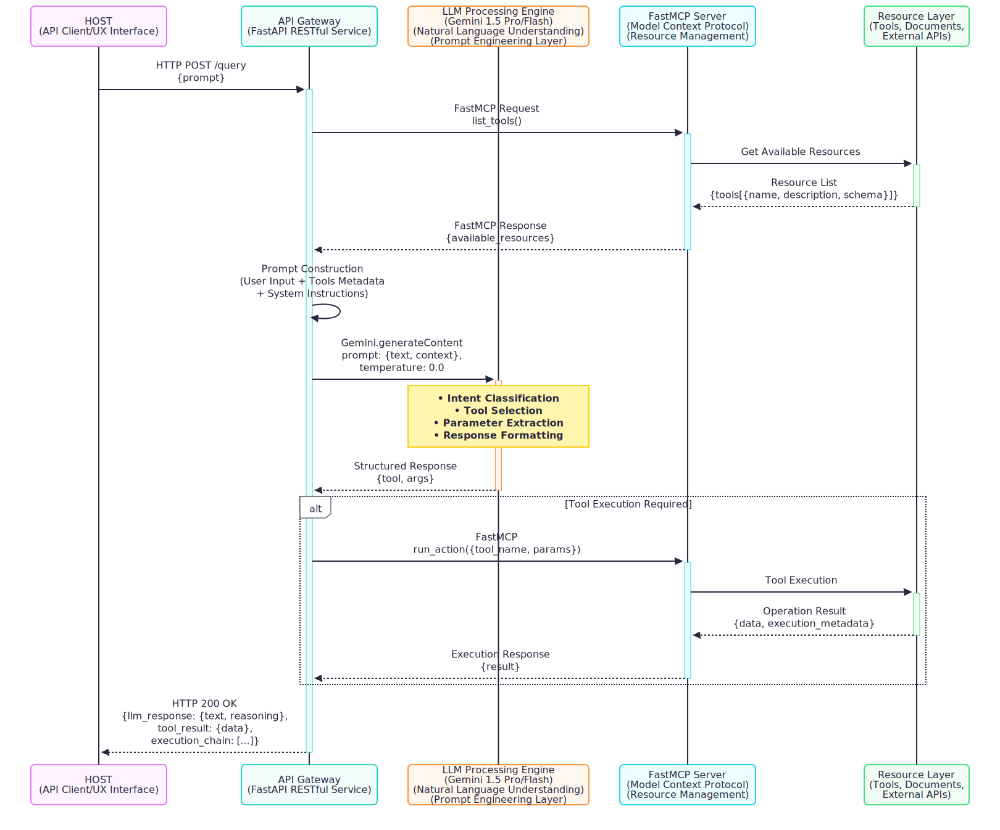

# Sistema LLM com Model Context Protocol

Sistema de processamento de linguagem natural que integra LLM (Gemini 2.5 Flash) com recursos externos via Model Context Protocol (MCP) para execução de Tarefas.

- **Cálculos Geométricos**:
  - Área de quadrado (dado o lado)
  - Área de círculo (dado o raio)

- **Integração com IBGE**:
  - Busca de código IBGE por município/UF
  - Normalização automática de nomes de cidades

- **Cálculo de Cotações**:
  - Conversão automática de unidades (m² para hectares)
  - Cálculo de custeio agrícola baseado em:
    - Área segurada
    - Valor de custeio ou LMI
    - Localização (cidade/UF)

- **Assistência Inteligente**:
  - Identificação de parâmetros faltantes
  - Guia de uso para funções disponíveis


## Arquitetura


## Componentes Principais

- **API Gateway**: FastAPI (Python)
- **LLM Engine**: Gemini 1.5 Pro/Flash
- **MCP Server**: FastMCP (Model Context Protocol)
- **Resource Layer**: Ferramentas, documentos e APIs externas

## Stack Técnica

- **Backend**: FastAPI (Python)
- **LLM**: Google Gemini 1.5
- **Protocol**: Model Context Protocol (FastMCP)
- **Comunicação**: REST API + FastMCP Calls

## Endpoint Principal

```bash
POST /query
Content-Type: application/json

{
  "prompt": "Sua consulta aqui",
}
```

## Configuração

```env
GEMINI_MODEL=gemini-2.5-flash
GEMINI_API_KEY=api-key
IBGE_API="https://servicodados.ibge.gov.br/api/v1"
```

## Execução

```env
uvicorn src.main:app --reload
```